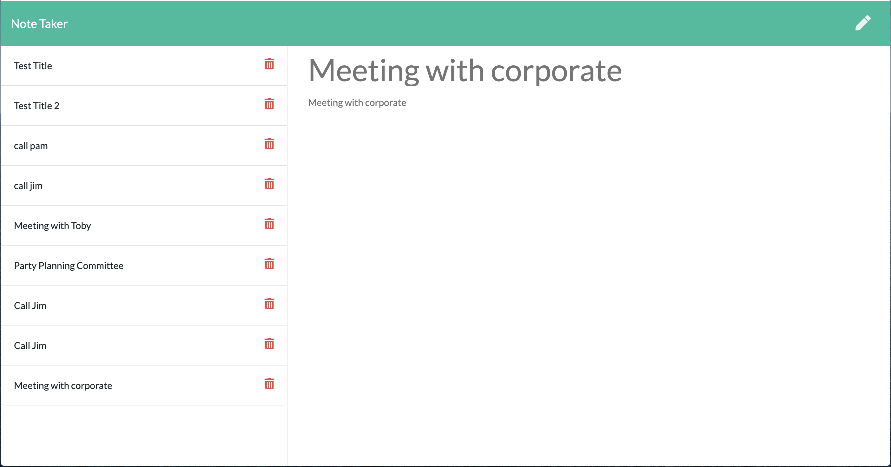

# Note Taker App

## Description
This application allows a user to create, edit, and save notes. It is designed primarily for the workplace, enabling users to create notes and tasks in order to stay on track. Upon entering the note it is saved in a database for access at a later date.

## Deployed
Github: https://anthonypotts.github.io/note-taker/

### Table of Contents
- [Usage](#usage)
- [NPM](#npm-packages)
- [Contributors](#contributors)
- [Screenshot](#screenshot)
- [About](#about-me)

## Usage
```
AS A small business owner
I WANT to be able to write and save notes
SO THAT I can organize my thoughts and keep track of tasks I need to complete
```

## NPM Packages
Express.js

## Contributors
Anthony Potts (Github: anthonypotts)

## Screenshot


## About Me
As a developing developer in the full stack realm, I strive to provide engaging and thoughtful webpages and applications that meet my clients' needs to interact with an ever-changing and expandingly technical world. Thank you for visiting my page. Please don't hesitate to reach out!